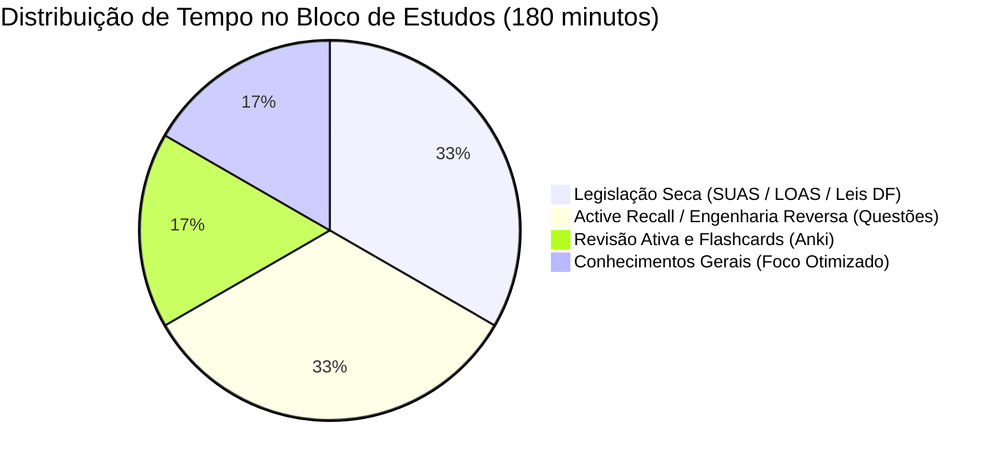
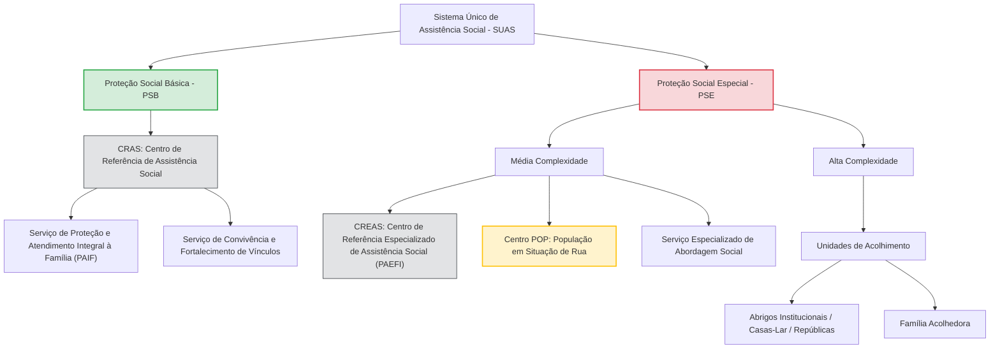

# 🎯 Cronograma de Estudos Tático de Alta Performance — SEDES DF (Agente Social)

> **"A aprovação é um fato matemático de alocação de tempo e energia."**
> Este documento representa o seu mapa de guerra para o cargo de **Agente Social (Cargo 200)**, estruturado com base no edital do **Instituto Quadrix** e rigorosamente confrontado com as fontes oficiais do seu NotebookLM (SEDES DF, LOAS, Leis do DF e Maria da Penha). Aqui, aplicamos as ciências da cognição, da biologia e a análise estatística de Pareto para garantir o seu nome no Diário Oficial do GDF.

---

## 📊 1. A Matemática da Aprovação (O Funil do Agente Social)

Para passar, você precisa compreender a assimetria brutal de pontuação deste concurso. O edital distribui os **200 pontos totais** da seguinte forma:

```mermaid
gantt
    title Distribuição dos Pontos no Concurso (Total: 200 pontos)
    dateFormat  X
    axisFormat %s

    section Prova Discursiva
    Conhecimentos Específicos (CAC) : active, 0, 100

    section Prova Objetiva
    Conhecimentos Específicos (40 Q x Peso 2) : crit, 100, 180
    Conhecimentos Gerais (20 Q x Peso 1) : 180, 200
```

### O Diagnóstico Estratégico:

- **O Núcleo Duro (90% dos Pontos):** A soma da **Prova Discursiva (100 pontos)** com a parte de **Conhecimentos Específicos da Prova Objetiva (80 pontos)** equivale a **180 dos 200 pontos totais (90%)**. Ambos são inteiramente sobre a área Específica!
- **O Mínimo de Sobrevivência (Gerais):** As matérias gerais (Língua Portuguesa, RIDE, PDPM, LODF) somam apenas 20 pontos. O seu objetivo aqui é puramente **tático**: garantir o mínimo de **10 pontos** (acertar 10 das 20 questões) para não ser eliminado do certame.
- **A Regra da Quadrix:** As provas são de **Múltipla Escolha (A, B, C, D, E)**. **NÃO HÁ penalização por erro** (uma errada não anula uma certa). **Regra de Ouro:** NUNCA deixe nenhuma questão em branco no dia da prova!

---

## 🔄 2. Ciclo de Estudos Dinâmico (Alocação Assimétrica)

Em vez de uma agenda semanal rígida de segunda a domingo (que gera frustração quando há imprevistos), você utilizará um **Ciclo de Estudos Dinâmico**. O ciclo é medido por **horas estudadas acumuladas** e gira continuamente.

### A Divisão de Carga Horária (Sessões de 3 Horas):

Cada bloco de estudo do seu ciclo terá **3 horas**, divididas sob a proporção **85% Específica / 15% Geral**.

---

## 📅 3. O Ciclo de Estudos de 4 Fases (Rotação de Conteúdo)

Gire as fases abaixo em sequência. Cada fase representa um dia ou período de estudo focado. Ao terminar a Fase 4, reinicie na Fase 1.

### 🛡️ FASE 1: Proteção Social Básica, Programas e Benefícios do DF

- **Foco Específico (2h30):**
  - **Teoria & Lei Seca:** Constituição Federal (Arts. 203 e 204); Lei nº 8.742/1993 (LOAS) - do Art. 1º ao 15; PNAS/2004 (Diretrizes e Proteções) e NOB/SUAS 2012 (Princípios Organizativos e Diretrizes).
  - **Programas e Benefícios GDF (Foco Extremo):** Regras de elegibilidade, valores e cumulação do **DF Social**, **Cartão Prato Cheio** e **Cartão Gás** (Confrontados com 2025/2026); **Benefícios Eventuais da Assistência Social do DF (Lei Distrital nº 5.165/2013 e Decreto nº 35.191/2014)**; **SISAN e Restaurante Comunitário (Decreto nº 33.329/2011)**.
  - **Ferramenta:** Estudo ativo baseado nos cards do seu arquivo `missao2Flashcards.csv`.
- **Foco Geral Otimizado (30 min):**
  - **Língua Portuguesa:** Compreensão, coesão textual (referenciação e conectores) e reescrita de frases (Padrão Quadrix).

### 🚨 FASE 2: Proteção Especial, População em Situação de Rua e Saúde Mental

- **Foco Específico (2h30):**
  - **Teoria & Lei Seca:** Equipamentos Estatais (CREAS, Centros POP, Unidades de Acolhimento); Serviço Especializado em Abordagem Social; Políticas Setoriais (Decreto Federal nº 7.053/2009 - População em Situação de Rua).
  - **Saúde Mental e Redução de Danos:** Noções de sofrimento psíquico, vulnerabilidade social, abordagem humanizada não estigmatizante, noções de redução de danos e articulação com a rede psicossocial/CAPS.
  - **Técnica de Feynman:** Desenhe mentalmente o fluxo de um usuário em situação de rua com transtornos mentais ou uso prejudicial de substâncias sendo atendido pela Abordagem Social e direcionado de forma intersetorial (Centro POP + CAPS).
  - **Ferramenta:** Praticar com os cards do seu arquivo `missão1Flashcards.csv`.
- **Foco Geral Otimizado (30 min):**
  - **RIDE e LODF:** Aspectos socioeconômicos da RIDE (LC 94/1998 e Dec. 7.469/2011) e **LODF (Título VI - Da Ordem Social, especialmente as Seções de Assistência Social e Saúde)**.

### ⚖️ FASE 3: Lei Maria da Penha, LOAS Atualizada (BPC) e Legislação da Carreira do DF

- **Foco Específico (2h30):**
  - **Lei Maria da Penha (Lei nº 11.340/2006):** Foco nos Artigos 5º (Configuração da violência) e 7º (As 6 formas de violência - incluindo a **Violência Vicária, adicionada pela Lei nº 15.384/2026**). _O edital garante no mínimo 3 questões sobre Maria da Penha com base no Art. 6º da Lei Distrital nº 7.462/2024._
  - **LOAS Atualizada (2024/2026):** Artigos 20 e 21 (Regras do BPC com limite padrão de 1/4 do salário-mínimo, exigência de **biometria via CIN/CNH conforme Lei nº 14.973/2024** no Art. 20, § 12-A e nova regulação do cálculo da renda familiar pela **Lei nº 15.077/2024** no Art. 20, § 3º-A); e Artigos 26-A a 26-C (Auxílio-Inclusão - 50% do BPC para portadores de deficiência moderada ou grave que trabalhem por até 2 salários-mínimos, gerando suspensão automática do BPC).
  - **Ferramenta:** Exercitar ativamente usando o seu arquivo `missao3Flashcards.csv`.
- **Foco Geral Otimizado (30 min):**
  - **Legislação Específica da Carreira & PDPM:** Plano Distrital de Políticas para Mulheres (PDPM) e a crucial **Lei Distrital nº 7.484/2024 (Lei da Carreira de Desenvolvimento e Assistência Social do DF - Especialidades EDAS/TDAS)**.

### 🚑 FASE 4: Primeiros Socorros & Atendimento em Situações de Emergência

- **Foco Específico (2h30):**
  - **Teoria & Ações Imediatas:** Protocolos de obstrução de vias aéreas (Manobra de Heimlich em adultos e lactentes), condutas em crises convulsivas (**lateralizar a cabeça e colocar na Posição Lateral de Segurança - PLS - após a crise para evitar asfixia**; remover próteses móveis e afastar objetos perigosos), traumas e queimaduras de 1º, 2º e 3º grau.
  - **Habilidades Práticas de Simulação:** Praticar visualmente a sequência de emergências clínicas e traumas.
  - **Ferramenta:** Memorizar nomenclaturas de acionamento (SAMU 192 vs. Bombeiros 193) com base nos cards de `missao4Flashcards.csv`.
- **Foco Geral Otimizado (30 min):**
  - **Ética e Legislação do DF:** Lei Complementar nº 840/2011 (Estatuto dos Servidores Públicos do DF - Foco em Deveres, Proibições, Regime Disciplinar e Processo de Apuração - Títulos I, V, VI e VII).

---

## 🏛️ 4. O Coração do SUAS: Estrutura Organizativa

Para evitar a "ilusão de competência", revise mentalmente a hierarquia de atendimento socioassistencial desenhada abaixo antes de iniciar qualquer estudo teórico:

---

## 💸 5. Tabela Comparativa de Programas Assistenciais do GDF

A banca Quadrix adora confundir o candidato trocando os requisitos e as características exclusivas dos benefícios do DF. Memorize esta tabela (atualizada e validada pelo NLM):

| Benefício              | Base Legal (DF)   | Valor / Periodicidade                                             | Requisito de Renda                                                                      | Uso / Finalidade                                                                                                                     | Permite Cumulação?                                  | Permite Saque?                                               |
| :--------------------- | :---------------- | :---------------------------------------------------------------- | :-------------------------------------------------------------------------------------- | :----------------------------------------------------------------------------------------------------------------------------------- | :-------------------------------------------------- | :----------------------------------------------------------- |
| **DF Social**          | Lei nº 6.965/2021 | **R$ 150,00** mensal                                              | Renda familiar _per capita_ de até **1/2 salário-mínimo** (priorizando extrema pobreza) | **Livre uso.** Visa à superação da extrema pobreza e autonomia familiar.                                                             | **Sim**, acumula com Prato Cheio, Cartão Gás e BPC. | **Sim** (Saque permitido da conta poupança social)           |
| **Cartão Prato Cheio** | Lei nº 7.009/2021 | **R$ 250,00** mensal (Ciclo de **6 meses** - Decreto 48.095/2025) | Renda familiar _per capita_ de até **1/2 salário-mínimo**                               | **Segurança Alimentar.** Compra de gêneros alimentícios. Prazo de utilização do crédito não inferior a 12 meses (Lei nº 7.294/2023). | **Sim**, acumula com os demais benefícios.          | **Não** (Restrito às máquinas de estabelecimentos de comida) |
| **Cartão Gás**         | Lei nº 6.938/2021 | **R$ 100,00** **bimestral**                                       | Renda familiar _per capita_ de até **1/2 salário-mínimo**                               | **Gás de Cozinha.** Compra exclusiva de botijão GLP 13kg em revendedoras autorizadas.                                                | **Sim**, acumula com os demais benefícios.          | **Não** (Apenas crédito no comércio credenciado)             |

---

## 📝 6. Planejamento Tático para a Prova Discursiva (100 Pontos)

A Prova Discursiva para o cargo de Agente Social consiste em uma **redação sob a forma de texto dissertativo-argumentativo** de **20 a 30 linhas** sobre os Conhecimentos Específicos. Ela vale metade de toda a sua nota (100 pontos). A banca avaliará sua redação sob as seguintes lentes:

1.  **Conteúdo e Atendimento ao Comando (CAC) — Peso 7.0:** Profundidade dos conceitos, clareza técnica e fundamentação legal. (Máximo: 3,00 pontos).
2.  **Organização Textual (OT) — Peso 1.5:** Coesão, coerência e estruturação formal do texto. (Máximo: 3,00 pontos).
3.  **Domínio da Língua Portuguesa (DLP) — Peso 1.5:** Correção gramatical e adequação ao registro formal culto. (Máximo: 3,00 pontos).

> [!IMPORTANT]
> A gramática pura e a organização estética valem muito pouco comparados ao **domínio técnico da área específica**. Para tirar nota máxima, você deve redigir como um **Agente Social de carreira**, citando institutos legais, leis e fluxos organizacionais do SUAS.

### Rotina Semanal de Produção Discursiva:

- **Toda Sexta-feira:** Selecione um tema de Conhecimentos Específicos (Exemplo: _"O papel do Agente Social no acolhimento de pessoas em situação de rua através do Centro POP"_ ou _"A intersetorialidade na prevenção da violência doméstica sob a égide da Lei Maria da Penha"_).
- **Escreva à Mão:** Faça um rascunho de **20 a 30 linhas** em folha pautada. Isso condiciona a sua caligrafia, o controle de espaço e o ritmo de escrita sob pressão.
- **Autoavaliação Técnica:** Faça o teste de Feynman no seu próprio texto: _Eu consegui fundamentar minha resposta citando a lei correspondente (ex: Lei 11.340/06, LOAS 8.742/93, Nob/SUAS)? Minha linguagem demonstra o papel preventivo/protetivo do cargo?_

---

## 🧠 7. Práticas Biológicas e Condicionamento Circadiano

Estudar não é apenas acumular dados; é preparar o cérebro físico para um estresse extremo de 4 horas no dia da prova.

- **Condicionamento Circadiano (O Simulado da Tarde):**
  - A prova para Agente Social (TDAS) será realizada no **turno da tarde**.
  - **Ação:** Todo **Sábado** (ou Domingo) às **13h30**, faça um simulado completo de 4 horas sem interrupções, sem celular e sem consulta. Isso treina o seu cérebro a atingir o pico de atenção cognitiva no exato horário da prova real, além de cimentar a resistência lombar e física necessária.
- **Consolidação de Memória Longa (O Sono REM):**
  - A Lei Seca e os valores de benefícios assistenciais são consolidados durante o sono REM profundo.
  - **Ação:** Evite madrugadas em claro estudando. Mantenha uma higiene rígida de sono de 7h a 8h por noite. O sono é a fase de gravação física dos seus flashcards no córtex cerebral.
- **Higiene Luminosa e Nutricional:**
  - Utilize iluminação de alerta no seu local de estudos (**LEDs frios de 5000K a 6500K**) para inibir a secreção de melatonina e elevar o foco.
  - Mantenha um controle de glicemia estável durante os blocos de estudo: prefira carboidratos de baixo índice glicêmico e gorduras boas para evitar picos e quedas abruptas de energia mental.

---

## 🚀 8. Próximos Passos e Metodologia Diária

Para fazer este cronograma gerar resultados práticos imediatamente, siga esta rotina diária ao acordar ou antes de iniciar qualquer ciclo:

1.  **Sessão de Aquecimento SRS (20-30 min):** Abra o seu software de flashcards e revise todos os cards acumulados do dia (revisando os arquivos `.csv` de Missão 1 a 4).
2.  **Abra o Bloco de Estudo do Ciclo:** Execute a Fase correspondente do dia (Fase 1, 2, 3 ou 4).
3.  **Active Recall:** Ao final do estudo de qualquer lei, feche a folha e explique para si mesmo, em voz alta, o que acabou de ler (Técnica de Feynman).
4.  **Treine o Erro como Diagnóstico:** Em cada simulado ou bateria de questões, comemore os erros. Cada erro diagnosticado agora com base nos comentários e na lei seca representa uma questão a mais garantida no dia oficial da prova.

---

_Este cronograma foi desenhado estrategicamente para levá-lo ao topo da lista de classificados do Instituto Quadrix. Confie no processo, respeite a matemática do edital e estude com precisão cirúrgica._
